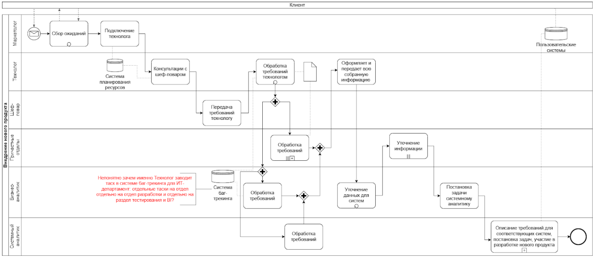
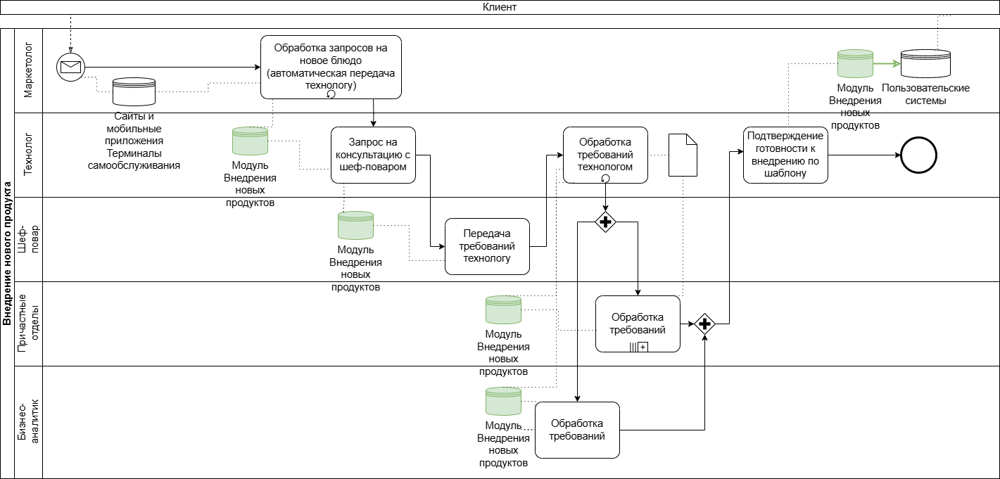
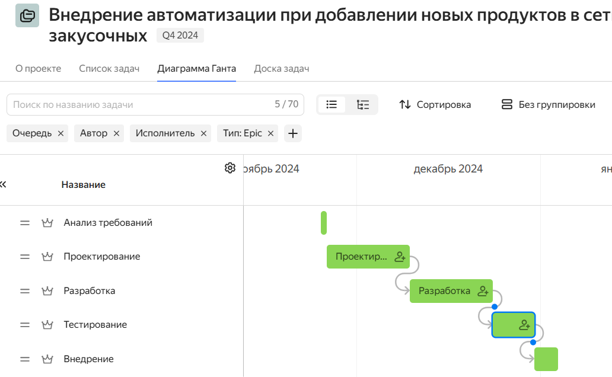
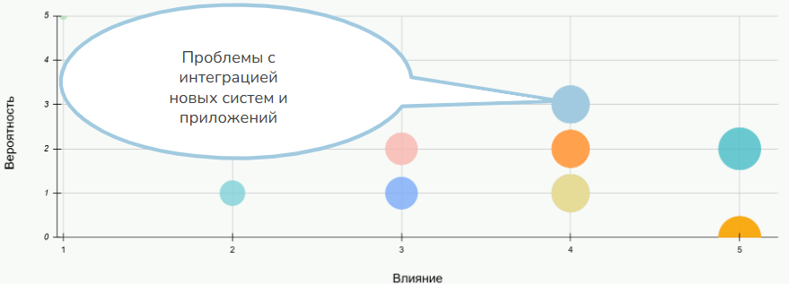
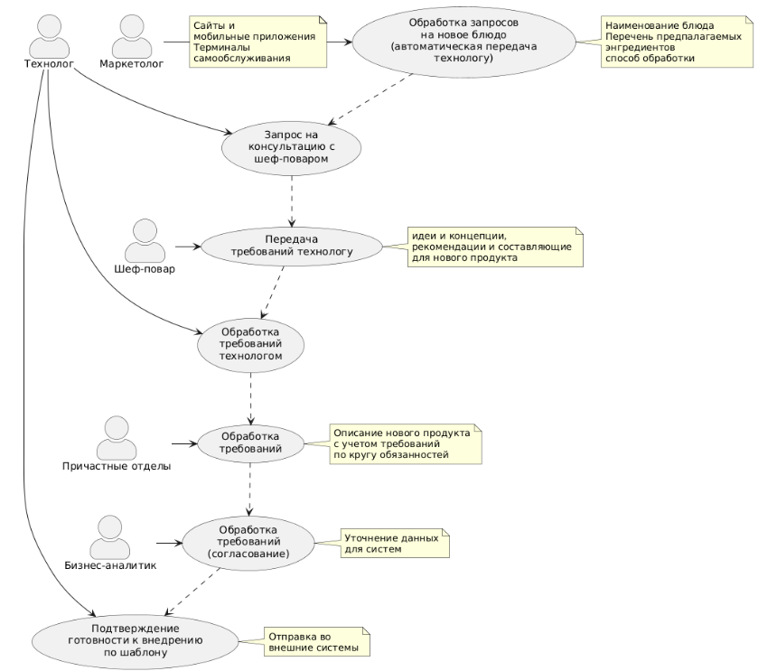
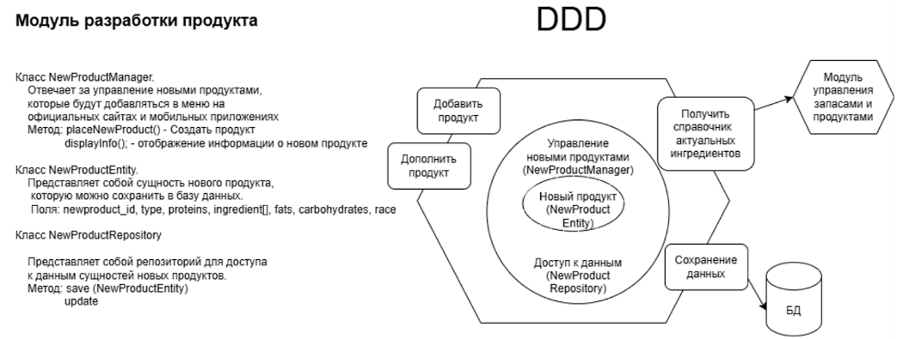
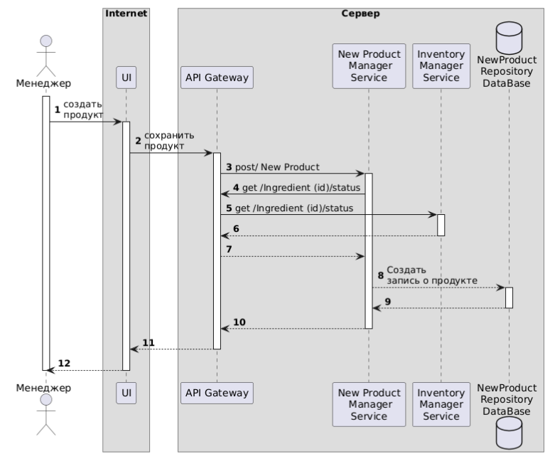
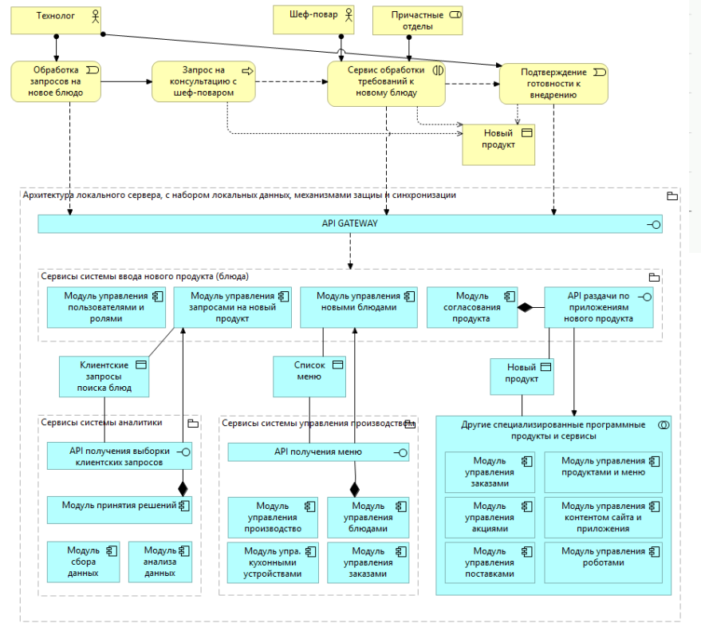

= Проект по разработке системы внедрения новых продуктов в сети столовых "Замысловатость"

== Общая информация
Текущий процесс организован крайне затруднительно, очень многим сотрудникам сети в целях внедрения нового продукта приходится взаимодействовать лично, и часто это занимает огромное количество времени (более 1 месяца, за это время конкуренты успевают внедрить по 6-7 новых продуктов)
 

== Цели внедрения проекта
Разработать специальный модуль для внутренних пользователей компании, позволяющий разработать продукт и быстро внедрить его в систему. Новый продукт будет добавлен в меню на официальных сайтах и мобильных приложениях. Клиенты смогут ознакомиться с информацией о новом продукте, его составе, пищевой ценности и сделать заказ онлайн.

. Автоматизировать сбор ожиданий клиентов через различные каналы (экономим время на обработку, больше охват)
. Автоматизировать процесс рассмотрения и наполнения недостающей информацией описания блюда (экономим время специалистов компании, снижаем потери информации и количество ошибок)
. Сгенерированное описание блюда внедряем в маркетинговые системы автоматически (исключаем затраты ресурсов на штучные проекты по внедрению продуктов, экономим время=деньги)

== Описание проекта
Процесс в данный момент - модель As is («Как есть»). Много участников и артефактов.

Вариант автоматизации процесса внедрения нового продукта (to be)

Результат неизвестен, документация минимальная, участие заинтересованных сторон постоянное влечет выбор работы с использованием Agile философии. Выбрана методология Agile - на проекте высокая степень неопределенности. Фокус на MVP и срок его реализации в 2 месяца. Ключевые работы:

* Спринт 1 — подготовка и предварительное исследование;
* Спринт 2 — определение требований и проектирование архитектуры;
* Спринт 3 — разработка MVP (2 недели, подключаем программистов как можно раньше);
* Спринт 4 — тестирование (неделя)
* Спринт 5 — внедрение, уточнение требований, планирование изменений или наращивания функционала (неделя), формирование бэклога (баги/фичи), приоритизация, актуализация документации, программисты устраняют баги, которые все пропустили, а пользователи нашли;
* Спринт 6 — вторая итерация разработки: существующую функциональность развить и технический долг уменьшить (2 недели);
* Повторяем пару раз, пока не выберем заложенный бюджет, убедимся в получении явного экономического эффекта (или положительной динамики) в положенные сроки. На этом остановимся, зафиксируем результат и будем размышлять о необходимости развития.
 
Выбрана методология Agile, т.к.

. У нас нет четкого времени окончания и невозможно сразу определить общую стоимость. 
. Требования не собраны. 
. Высокая степень неопределенности предполагает использование гибких методологий, фреймворков и подходов по управлению разработкой ПО:

*  Организация встреч - раз в неделю и работа по Канбан доске с Командой 
* При необходимости, добавляем ежедневные Дэйли
* Демо по итогам спринта
* Ретро в конце спринта
(гибкую методологию, всегда есть возможность донастроить по ходу проекта, исходя из постепенного слаживания Команды или внешних изменений)

link:https://tracker.yandex.ru/pages/projects/1[Проект tracker.yandex.ru]

== Roadmap проекта

== Команда проекта

.Команда проекта
[cols="2*",options="header"]  
|=== 
|Должность|Количество
|Представитель заказчика|1
|Менеджер проекта|1
|Архитектор|1
|Team Lead системных аналитиков|1
|Системный аналитик|2
|BE Разработчик|2
|FE Разработчик|1
|Тестировщик|2
|===

== Риски проекта

.Риски проекта
[cols="6,1,1,1*",options="header"]  
|=== 
|Виды рисков с их классификацией|Влияние|Вероятность наступления риска|Степень влияния риска
4+^|*Внешние риски*
|Изменение политического режима (падение империи)|	TRUE|0	|5
|Взрывы чёрных карликов, «тепловая смерть» галактик|	TRUE|0 |5
4+^|*Внутренние риски*
|Неправильное определение требований заказчика|	TRUE|3 |4
|Конфликты между членами команды проекта	|TRUE|2 |4
|Неправильный выбор технологий и инструментов|	TRUE| 2|5
4+^|*Стратегические риски*
|Изменение рыночных условий и требований клиентов|	TRUE|1 |3
|Расхождение между ожиданиями заказчика и результатами проекта|	TRUE| 1|4
|Неправильное определение ключевых показателей успеха проекта	|TRUE|2 |4
4+^|*Операционные риски*
|Нарушение бизнес-процессов из-за технических проблем|	TRUE|1 |4
|Недостаточная отказоустойчивость системы|	TRUE|2 |4
|Проблемы с обновлением и поддержкой программного обеспечения	|TRUE| 1|2
4+^|*Трансформационные риски*	
|Проблемы с интеграцией новых систем и приложений|TRUE|3 |4
4+^|*Проектные/программные риски*
|Неправильное планирование и оценка ресурсов|	TRUE| 2|3
|Неправильное определение и управление требованиями|	TRUE|1 |4
|Изменение требований в процессе разработки|TRUE|5 |1
|=== 

== Описание выбранного решения

Возможные последствия для проекта, если риск реализуется

*Интеграция* — узкое место любого проекта, которое всегда связано с риском. В нашем проекте над Ключевыми ИТ-системами работают разные команды. Предлагается особое внимание уделить проработке данного риска, так как он может вызвать следующие проблемы:

* невыполнение некоторых из предусмотренных проектом действий;
* смещение сроков реализации проекта в целом и его отдельных этапов;
* смещение сроков ввода объекта проекта в эксплуатацию;
* превышение бюджета проекта;
* отклонение от запланированных проектом результатов.

== Описание архитектуры с НФТ

Проведена ATAM сессия для учёта НФТ в архитектуре системы.

Компания состоит из множества отделений, которые находятся на разных планетах и в разных галактиках. Так как разрабатывается MVP, то целесообразно выполнить разработку и внедрение в одном крупнейшем и старейшем отделении (в галактике Млечный Путь), а потом масштабировать на другие отделения.

=== Требования к системе в целом

Определяем следующие общие требования к структуре и функционированию системы (требования к системе в целом должны производными от миссии и бизнес-целей Компании):

* Разрабатывается новая подсистема “Внедрение новых продуктов” в состав которой в целевом состоянии могут войти следующие модули:
** Модуль управления пользователями	 (из коробки, удовлетворяет всем требованиям, в том числе механизмы авторизации пользователей при доступе к ресурсам системы и запрашиваемой функциональности в соответствии с заданными в реестре пользователя правами);
** Модуль управления знаниями;
** Модуль управления формированием нового продукта
** Модуль управления интеграциями

* Программная, техническая и логическая структура системы должна базироваться на стандартизованных, унифицированных и сертифицированных продуктах (решениях).
* Окончательная структура разрабатываемого ПО и перечень взаимодействующих подсистем и их модулей будут определена на этапе разработки. 
* Уточнение требований и детальное наполнение ТЗ будет выполнено по результатам проведения работ по созданию MVP. 
* Система должна реализовывать возможность дальнейшей модернизации, как программного обеспечения, так и комплекса технических средств с учетом возможности расширения функциональных возможностей системы.

Для системы "Разработка нового продукта" можно выделить следующие ключевые модули и компоненты:

=== Модуль управления пользователями

* Классы: UserAdm, UserAaccount, UserAppRepository
Описание: Класс UserAdm отвечает за регистрацию и управление пользователями, и их ролями в соответствии с выполняемыми в системе функциями. UserAaccount представляет собой сущность пользователя и его полномочия, которую можно сохранить в базу данных. UserAppRepository представляет собой репозиторий для доступа к данным сущностей пользователей.

=== Модуль разработки продукта

* Классы: NewProductManager, NewProductEntity, NewProductRepository
Описание: Класс NewProductManager отвечает за управление новыми продуктами, которые будут добавляться в меню на официальных сайтах и мобильных приложениях. NewProductEntity представляет собой сущность нового продукта, которую можно сохранить в базу данных. NewProductRepository представляет собой репозиторий для доступа к данным сущностей новых продуктов.

Архитектура Service-Oriented Architecture (SOA) ориентирована на разбиение системы на набор независимых сервисов, каждый из которых выполняет свою уникальную функцию.

* Маркетолог заводит в системе описание нового продукта через web-форму 
* Web-приложение отправлāет запрос на сохранение нового продукта через API Gateway
* API Gateway направлāет запрос к New Product Manager Service.
* New Product Manager Service проверяет валидность данных о новом продукте
* New Product Manager Service обращается к Inventory Manager Service для получения актуальной информации о актуальности ингредиентов.
* New Product Manager Service создает новую запись о новом продукте
* После успешной проверки и обработки новой записи о новом продукте, New Product Management Service возвращает ответ приложения через API Gateway
* Повторяем шаги для других пользователей, изменяющих/дополняющих запись о новом заказе

Наиболее подходящая методология для нашей задачи SOA. Единая точка входа. API-шлюз через сервис аутентификации проверит права и даст внести новый продукт (обращение к сервису управления новым продуктом) или наполнить продукт данными по кругу своих обязанностей (запрашивая данные в смежных системах при необходимости). По готовности продукта к публикации во все заинтересованные системы, технолог может опубликовать готовый к внедрению продукт через сервис публикации.
Реализуем отдельные сервисы с изолированным контекстом доменов. Внутри сервиса реализуем по DDD.

Архитектурная диаграмма представлена в виде приложения “Замысловатость.archimate”. Диаграмма показывает компоненты, их взаимодействия и точки контроля безопасности.Архитектура разработана с учетом ключевых требований:

Система должна реализовать механизм контроля доступа на основе ролей (RBAC), который будет управлять доступом пользователей к ресурсам системы в зависимости от их ролей и разрешений:

* Система должна соответствовать стандартам безопасности, таким как ISO/IEC 27001, с уровнем соответствия не менее 90%.
* Количество инцидентов, связанных с нарушением доступа, не должно превышать 99% в течение отчетного года.
* Доля пользователей с неправомерным доступом должна составлять не более 5% от общего числа пользователей по результатам ежеквартального аудита.
* Время реакции на инциденты нарушения доступа должно составлять не более 30 минут.
Время отклика при проверке прав доступа не должно превышать 200 мс.
* Тесты на нагрузку для оценки влияния RBAC на производительность системы должны оцениваться, как отсутствие влияния, то есть не превышать общего приемлемого значения на отклик в 200 миллисекунд.

Сохранность информации должна быть обеспечена  при следующих аварийных ситуациях:

* сбой или выход из строя технических средств, на которых осуществляется эксплуатация системы;
* сбои электропитания;
* сбой общесистемного программного обеспечения;
* сбой или отказ прикладного программного обеспечения;
* сбой в работе средств связи между серверной и клиентской частями (обрывы связи), в том числе и в момент передачи данных;
* сбой из-за ошибок в работе персонала.

.Нефункциональные требования
[options="header"]
|===
|Требование |Атрибут 
|Доступность	| Система должна быть доступна 99.9% времени в течение месяца (менее 43 минут простоя в месяц)
|Минимальное время простоя	| Система должна быть доступна 99.9% времени в течение месяца (менее 43 минут простоя в месяц). Неплановый простой должен составлять не более 30 минут в случае сбоев
|Быстрый доступ к системе	| Время входа в систему должно быть не более 3 секунд после ввода учетных данных.
Поддержка однократной аутентификации (SSO) для ускорения процесса входа.
|Быстродействие	|  Все операции (запросы, действия пользователя) должны выполняться не более чем за 200 миллисекунд .
Загрузка страницы должна занимать не более 1 секунды на устройствах с типичным интернет-соединением.
|Отзывчивость системы	| Система должна отвечать на пользовательские действия в течение 100–300 миллисекунд .
Интерфейс должен оставаться интерактивным даже при выполнении фоновых задач.
|Минимальное время ответа на запрос	|   Время ответа на запрос к базе данных должно быть не более 50 миллисекунд для простых запросов.
Для сложных запросов (например, генерация отчетов) время ответа не должно превышать 5 секунд .
|Количество ошибок	|  Количество критических ошибок (вызывающих отказ системы) не должно превышать 1 на 100 000 запросов .
Несколько незначительных ошибок (например, временные сбои подключения) допустимо, но их частота должна быть менее 1 на 10 000 запросов .
|Время восстановления после отказа системы	| Время восстановления после отказа основного компонента системы (RTO — Recovery Time Objective) должно быть не более 15 минут .
Время восстановления данных (RPO — Recovery Point Objective) должно быть не более 5 минут , чтобы минимизировать потерю информации.
|Защита от сбоев	|  Использование резервного копирования данных каждые 15 минут .
Дублирование ключевых компонентов системы (load balancers, серверы базы данных).
Применение отказоустойчивых механизмов, таких как RAID для хранения данных и репликация базы данных.
|Целостность данных	|  В системе должна быть предусмотрена возможность восстановления данных по состоянию не более чем за одни сутки до момента аварии
|Добавление новых точек входа для создания заказов	| Система должна поддерживать интеграцию с новыми каналами (API, web-формы, мобильные приложения) без значительного изменения архитектуры.
Время добавления новой точки входа не должно превышать 2 недели разработки. 
|Горизонтальное масштабирование (увеличение мощности при увеличении количества заказов)	| Система должна поддерживать увеличение мощности путем добавления новых серверов или экземпляров приложения.
При увеличении количества заказов на 30% , производительность системы должна сохраняться на том же уровне за счет добавления ресурсов.
Масштабирование должно быть автоматическим или требовать минимального вмешательства администратора.  
|Система должна соответствовать стандартам безопасности ISO/IEC 27001|уровень соответствия не менее 90%.
|Количество инцидентов, связанных с нарушением доступа |не должно превышать 99% в течение отчетного года.
|Доля пользователей с неправомерным доступом |должна составлять не более 5% от общего числа пользователей по результатам ежеквартального аудита
|Время реакции на инциденты нарушения доступа |должно составлять не более 30 минут
|Время отклика при проверке прав доступа | не должно превышать 200 мс
|Тесты на нагрузку для оценки влияния RBAC на производительность системы |должны оцениваться, как отсутствие влияния, то есть не превышать общего приемлемого значения на отклик в 200 миллисекунд
|===

== Заключение

Реализация этого проекта позволит оптимизировать бизнес-процессы, повысить эффективность работы сотрудников, улучшить качество обслуживания клиентов и сократить операционные затраты, а также открыть новые возможности для развития бизнеса за счет внедрения современных технологий и автоматизации рутинных задач, обеспечивая более быстрый доступ к информации для принятия решений.